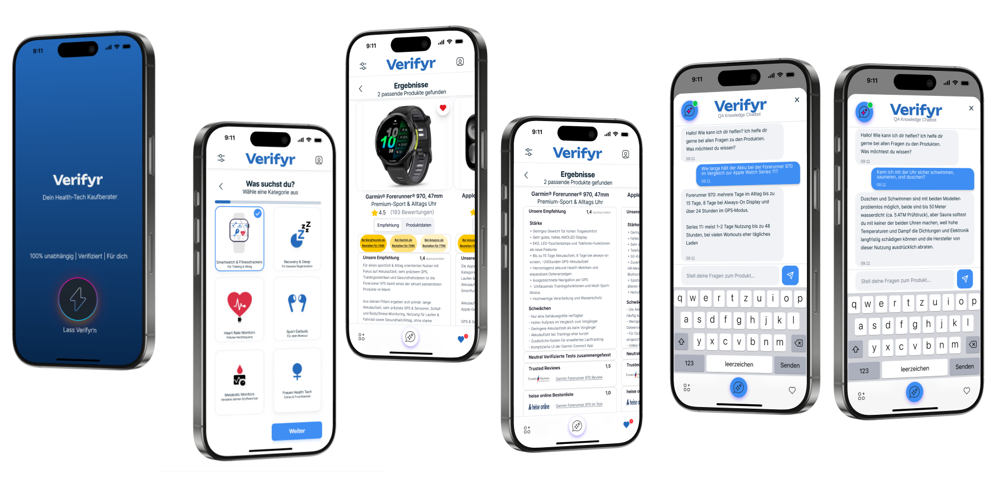
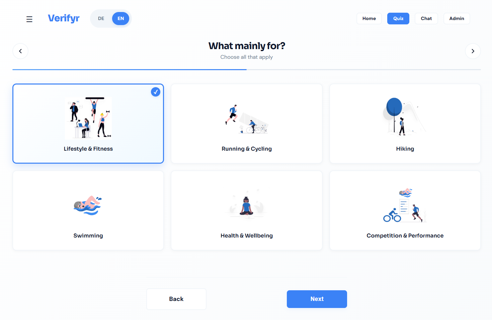
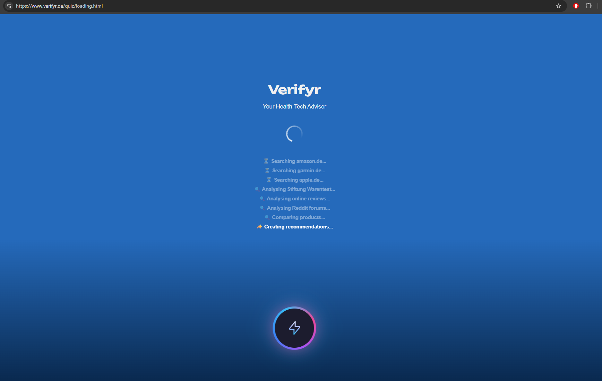
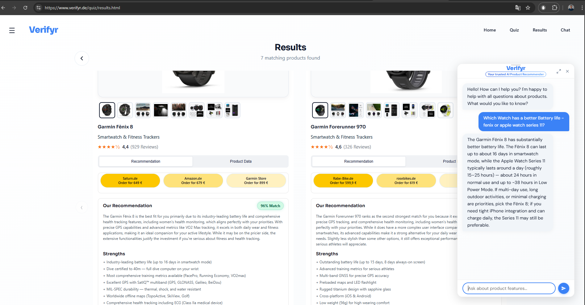
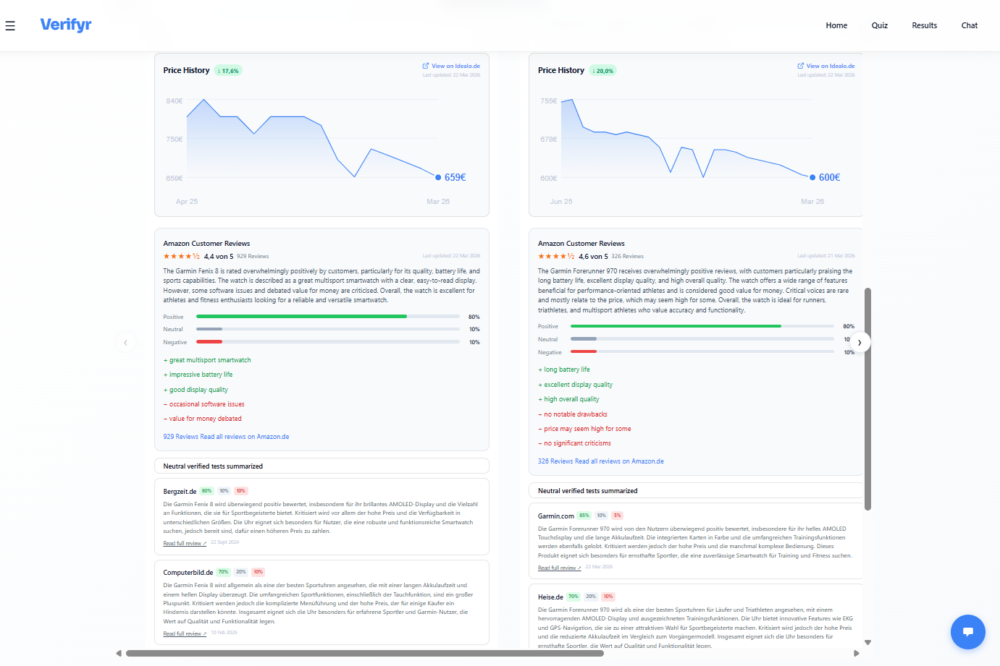
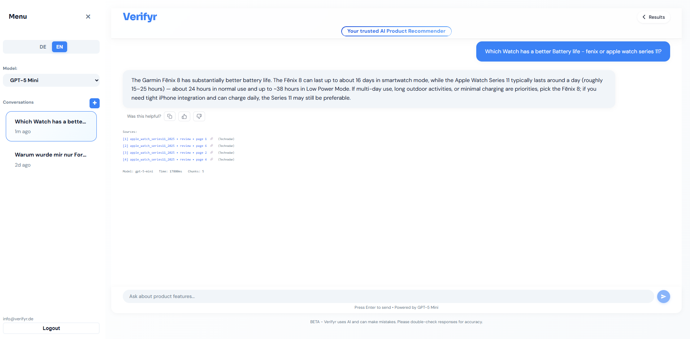

<p align="center">
  
</p>

<h1 align="center">Verifyr.de</h1>

<p align="center">
  <strong>Conversational AI assistant for wearable health-tech purchasing decisions.</strong>
</p>

<p align="center">
  
  
  
  <a href="https://uptime.betterstack.com/?utm_source=status_badge"></a>
  <a href="https://uptime.betterstack.com/?utm_source=status_badge"></a>
</p>

<p align="center">
  🌐 <a href="https://verifyr.de">www.verifyr.de</a>
</p>

Verifyr is a brand-independent AI assistant that compares and recommends health-tech wearables (smartwatches, fitness trackers, rings), curates expert reviews, and guides you from pre-purchase questions to post-purchase support — neutral, transparent, and in seconds.

Powered by a **conversational RAG pipeline**, Verifyr covers the full buyer journey: a guided 4-step quiz delivers personalised product matches with price history, Amazon sentiment analysis, and expert review summaries — while the chat interface handles pre- and post-purchase questions, grounded in verified product documents.

<p align="center">
  
</p>

<p align="center">
  
</p>

<p align="center">
  
</p>

<p align="center">
  
</p>

<p align="center">
  
</p>

<p align="center">
  
</p>

---

## Why Verifyr

| Problem | Verifyr's Solution |
|---|---|
| Too many tabs, too many reviews | Curated answers from verified sources in one place |
| Biased affiliate rankings | 100% brand-agnostic recommendations |
| Confusing tech specs | Plain-language explanations with source citations |
| No post-purchase support | Built-in QA chat for setup, how-tos, and troubleshooting |
| Scattered review sites | Aggregated expert review summaries with sentiment scores |

---

## Features

- **Guided quiz advisor** — 4-step flow (category → use cases → feature priorities → budget) feeds a two-tier recommendation engine with RAG-enhanced personalised insights
- **Product comparison carousel** — Side-by-side scrollable cards with dot indicators and swipe navigation on mobile
- **Price history chart** — Interactive SVG price chart with min/max markers and Idealo.de integration
- **Amazon Customer Reviews widget** — Aggregated star rating, sentiment breakdown (positive/neutral/negative %), and top pros/cons in German and English
- **Expert review boxes** — Curated summaries from tech publications (Chip.de, TechRadar, Heise, Computerbild) with sentiment badges, publish dates, and direct links
- **Reddit sentiment** — Community sentiment aggregated from relevant subreddits per product
- **YouTube video review widget** — Embedded video reviews from trusted tech creators per product
- **Conversational RAG chat** — Natural language questions answered with source citations grounded in product manuals and specifications
- **Hybrid retrieval** — BM25 keyword search + semantic vector search fused via RRF for maximum accuracy
- **Source-backed answers** — Every response cites `[Product, Document Type, Page X]`
- **Multilingual** — Fully bilingual DE/EN with language toggle; optimised for German and English queries
- **Saved conversations** — Multi-turn chat with persistent conversation history
- **Auth & access control** — Supabase JWT authentication with invite-only access
- **Admin panel** — Stats, conversation viewer, user management, web scraper, and Reddit sentiment analysis
- **System status page** — Real-time health monitoring, uptime tracking, and vector DB status
- **Analytics & observability** — Google Analytics 4 + PostHog funnel tracking + Langfuse LLM tracing

---

## Tech Stack

| Layer | Technology |
|---|---|
| Backend API | FastAPI (Python) |
| LLM | Claude Sonnet 4.6, Claude Haiku 4.5, GPT-5 Mini, GPT-4o Mini, GPT-5.1, Gemini 2.5 Flash/Pro |
| Vector Database | Qdrant (embedded mode) |
| Keyword Search | BM25 |
| Embeddings | `intfloat/multilingual-e5-base` — multilingual, runs locally, zero cost |
| Retrieval | Hybrid BM25 + Vector with RRF fusion, Top-5 chunks |
| Auth | Supabase (JWT RS256/ES256 + HS256 fallback) |
| Observability | Langfuse v3 + PostHog + GA4 |
| Frontend | Vanilla HTML / JavaScript / CSS |

---

## Architecture

| Layer | Component | Description |
|---|---|---|
| 1 | **Frontend** | Vanilla HTML/CSS/JS served as static files by FastAPI. Landing page, quiz advisor, results carousel, chat interface, admin panel, auth. No framework — fast first paint, SEO-friendly. |
| 2 | **FastAPI Backend** | 20+ async endpoints. Supabase JWT middleware. `Cache-Control: no-cache` on all HTML/JS/CSS ensures users always get fresh code without hard refreshes. |
| 3 | **Recommendation Engine** | Two-tier quiz system. Tier 1: weighted metadata scorer (15% category / 45% use-cases / 40% features). Tier 2: RAG-enhanced personalised strength + weakness bullets and rank-aware LLM reasoning per product. |
| 4 | **Hybrid Retrieval** | BM25 + Qdrant vector search run in parallel, fused via RRF. Product diversity guard ensures balanced context for comparison queries. Adaptive top-K (K=5 simple / K=8 complex). |
| 5 | **LLM Generation** | Multi-provider abstraction (Claude, OpenAI, Gemini). Inline citation enforcement via system prompt + regex extraction. Language-aware and quiz-profile-aware responses. |
| 6 | **Data Layer** | Qdrant (embedded) + BM25 (in-memory) + `chunks.json` + `products_metadata.json` + review JSONs per product |

### Key Design Decisions

**Hybrid search over pure vector** — Product manuals contain exact model numbers and spec values. Vector search misses these; BM25 excels at them. Hybrid + RRF captures both signal types without score normalisation complexity.

**800-token chunks with 200-token overlap** — Too small (200–400 tokens) loses context; too large (1200+) fills context quickly with noisy retrieval. 800 tokens fits a complete spec section; 200-token overlap prevents information loss at boundaries.

**`multilingual-e5-base` over `text-embedding-3`** — 60% of queries are German. Local inference means zero API latency and zero cost, with support for 100+ languages.

**Qdrant embedded mode** — No separate Docker service. Everything stored in a local directory — zero infrastructure for a single-developer product.

**Supabase Auth** — Provides email auth, password reset, and invite flows out of the box. The backend only validates JWTs; it never stores passwords.

**Langfuse for observability** — Native LLM tracing with span-level drill-down, chunk relevance scoring, citation accuracy tracking, and per-query cost monitoring.

---

## Project Structure

```
verifyr - rag/
├── backend/
│   ├── main.py                 # FastAPI app — all routes + static file serving
│   ├── auth_middleware.py      # Supabase JWT validation (RS256/ES256 + HS256 fallback)
│   ├── recommendation/
│   │   └── rag_enhancer.py     # Tier 2 RAG — personalised strength/weakness generation
│   ├── ingestion/              # PDF processing, chunking, web scraper, Reddit scraper
│   ├── indexing/               # BM25 + Qdrant vector store indexing
│   ├── retrieval/              # Hybrid search (BM25 + Qdrant + RRF fusion)
│   └── generation/             # Multi-provider LLM client (Claude, GPT, Gemini)
├── frontend/
│   ├── index.html              # Landing page
│   ├── chat.html / app.js      # Chat interface with saved conversations
│   ├── auth.html / auth.js     # Login / signup
│   ├── admin.html / admin.js   # Admin panel (stats, users, scraper, Reddit analysis)
│   ├── status.html             # System status & health monitoring
│   ├── components/
│   │   └── auth-modal.js/.css  # Reusable auth modal
│   ├── quiz/                   # 4-step quiz advisor flow
│   │   ├── category.html       # Step 1 — product category
│   │   ├── use-case.html       # Step 2 — use cases
│   │   ├── features.html       # Step 3 — feature priorities (max 10)
│   │   ├── budget.html         # Step 4 — budget range + special request
│   │   ├── loading.html        # Animated loading screen
│   │   └── results.html/.js    # Ranked product carousel + review widgets
│   ├── images/products/        # Product images
│   └── design-system/          # Design tokens, components, animations
├── data/
│   ├── raw/                    # Source documents organised by product
│   │   └── {product_id}/
│   │       ├── specification.pdf
│   │       └── reviews/
│   │           ├── amazon.de.manual_review_DDMMYYYY.json
│   │           └── review-results/
│   │               └── {source}_review_DDMMYYYY.json
│   ├── processed/              # chunks.json, bm25_index.pkl
│   ├── qdrant_storage/         # Vector database
│   ├── conversations/          # Saved conversation JSON files
│   └── products_metadata.json  # Product index (ratings, images, price history)
├── docs/                       # Architecture, dev phases, operations docs
├── tests/                      # Evaluation framework (Langfuse + RAGAS)
├── manage_server.ps1           # Server management helper
├── requirements.txt
└── LICENSE
```

---

## License

Licensed under the [Apache License 2.0](LICENSE).

---

**Verifyr** — [verifyr.de](https://verifyr.de)
